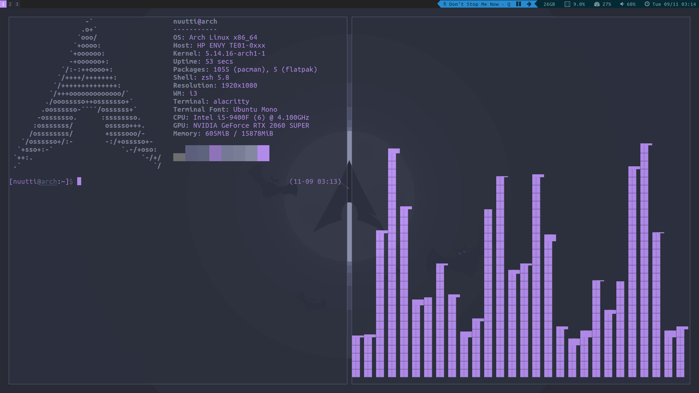
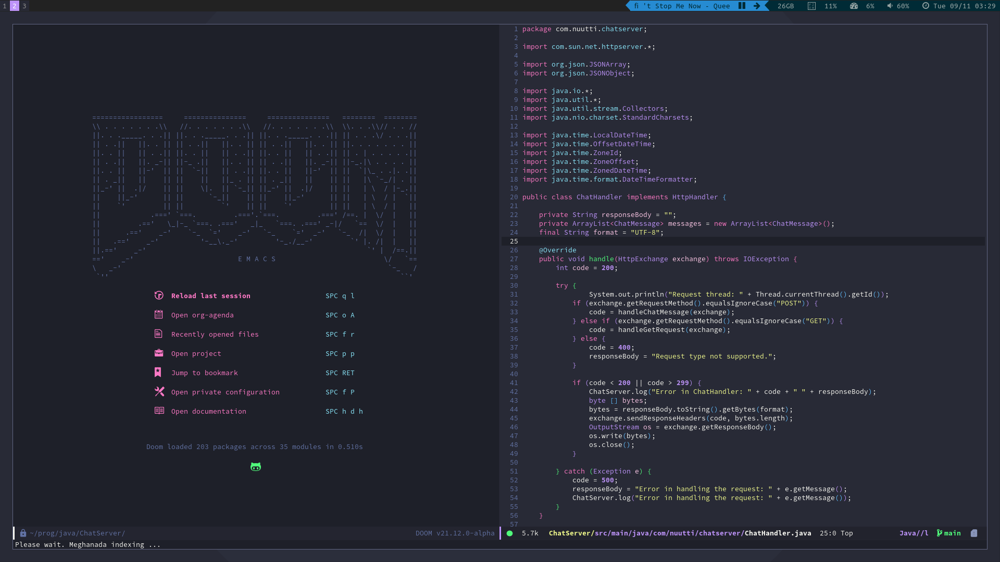

# linux-configs
This repo contains my dotfiles, keyboard layout, themes and wallpapers.   
install.sh script installs a window manager and my configs in a fresh arch installation.
Please don't install my setup, it will suck for you.
It's very specific and tailored for me, uses a keyboard layout nobody else can use and 
the setup script is not made to function in different circumstances.  

Must clone while in home directory ~/:
```bash
git clone https://gitlab.com/Nuuttiv/linux-configs
cd linux-configs
sudo ./install.sh
```   





